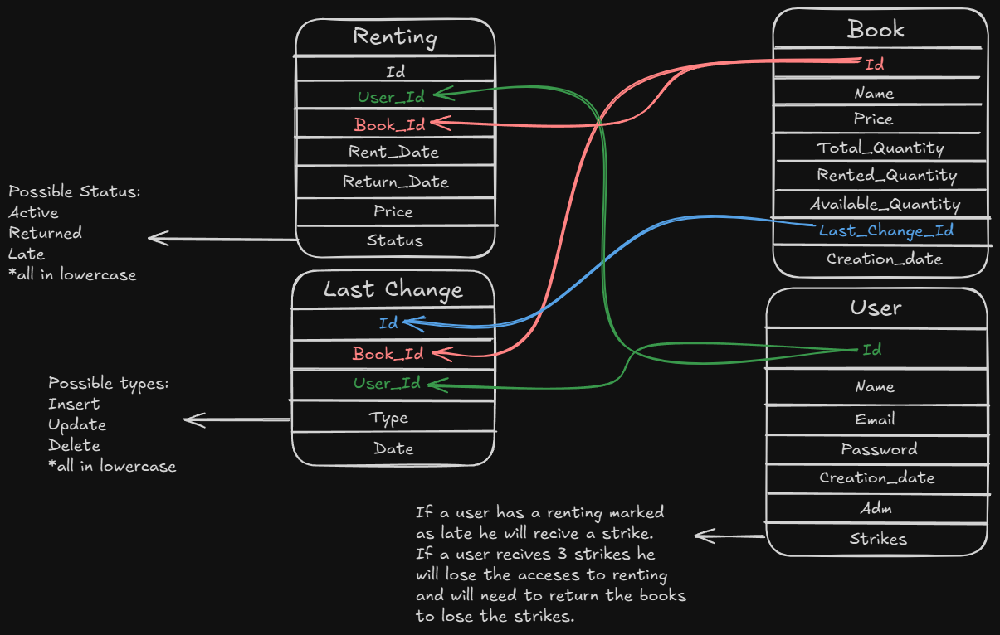

# Library in Java
Learning Java by creating a simple library renting system using SQLite.

## Run the code
Open the terminal and type the following commands in order:
````shell
javac Main.java
java -classpath ".;sqlite-jdbc-3.49.0.0.jar" Main   
````
_obs: do this command in the src folder_

## The DataBase
The database is designed to manage a library rent. containing 4 tables, **_users_** where the users data are located; 
**_books_** is the table where the books name, price, total quantity, available quantity and rented quantity are storage;
**_renting_** is where the renting is managed storaging the rent date, the price of the rent and the rent, the rent ending date,
the id of the user how rented and the id of the book rented;
### How the last changes table works
The **_last changes_** table is made to see how is the last user that edit a book.
**It does not retain the previous state of a book**; instead, it only records the type of modification ("insert", "deletion" and "update"), who modified it and when the change happens.
## How to create the database
To run the database you will need to have sqlite3 installed in your machine and run this commands in the Library folder
````shell
sqlite3 database.db < creation.sql
````
_obs: do this command in the src folder_

